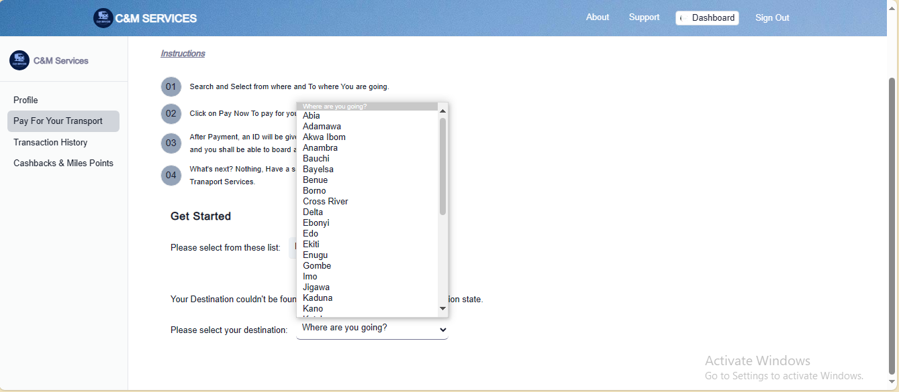
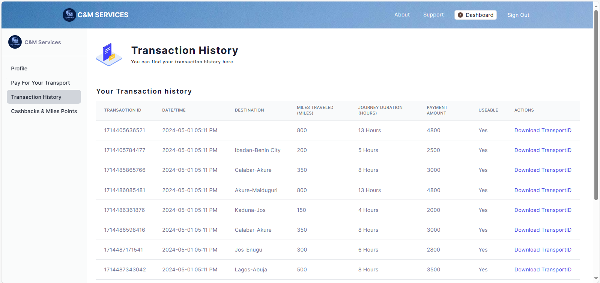
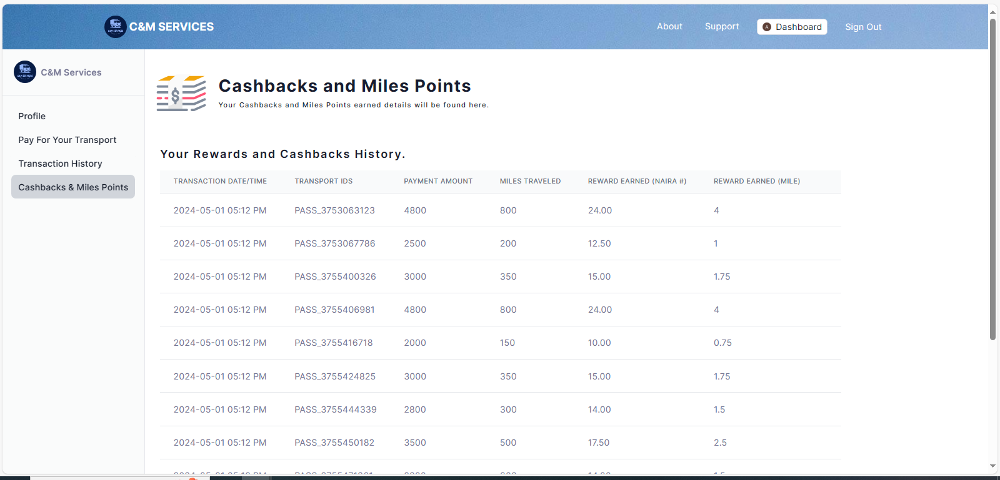

# User Manual for C&M Transport Services

Welcome to C&M Transport Services! This user manual will guide you through the steps to effectively utilize the features of our platform.

## Getting Started

### Creating an Account

1. Visit [https://candm-services.vercel.app/].
2. Click on the "Create Account" button.

3. Fill in the required information, such as your email address, password, and any other necessary details.
4. Click on the "Sign Up" button to complete the registration process.
5. As alternative, you can sign up using google.

### Signing In

1. Once you have created an account, return to the homepage.
2. Click on the "Log In" button.

3. Enter your email address and password.
4. Click on the "Sign In" button to access your account.

## Using the Web App

### Navigation

1. After logging in, you will be directed to the homepage, click on the dashboard.
2. Navigate to the sidebar and click on the "Payment" section.

### Making a Payment

1. In the Payment section, allow the website to access your location if prompted.
2. Select the destination you are traveling to from the list provided in the format (from-to), e.g., Ibadan-Delta.

- If your destination is not listed, you can just select a location from the list provided.

3. The transport fare will be calculated automatically at ₦10 per mile, and the duration at 0.5 hours per mile.
4. Click on the "Make Payment" button to proceed.

5. Complete the payment process.

### Viewing Transaction History

1. After successful payment, navigate to the sidebar and click on the "Transaction History" section.
2. In the last column (Action), locate your transaction and click on "Download Transport ID" to save it as a PDF.

### Checking Cashback & Miles Points

1. To view your cashback and miles points record, go to the sidebar and click on the "Cashback & Miles Points" section.

- Cashback is calculated at 0.5% of every payment for a transport fare.
- Miles Points are calculated at 0.5% per mile.

## Additional Support

If you encounter any issues or have questions about using C&M Transport Services, please contact us at abdulsalamasheem@gmail.com.

Thank you for choosing C&M Transport Services! We hope you have a pleasant experience using our platform.
